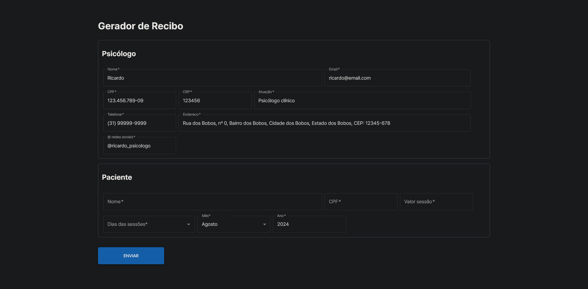

# Gerador de Recibos de Pagamento para Psicólogos

Este projeto é uma aplicação web para gerar recibos de pagamento para psicólogos, utilizando React, MUI (Material-UI), JQuery, JQuery Mask e PDFMake.



## Funcionalidades

- **Criação de recibos personalizados**: Insira informações do paciente, detalhes da sessão e valores pagos.
- **Formatação automática de campos**: Utilização de JQuery Mask para formatação de campos como CPF, telefone e valor monetário.
- **Geração de PDF**: Criação de recibos em formato PDF com PDFMake, prontos para impressão ou envio por email.
- **Interface intuitiva**: Interface moderna e responsiva utilizando MUI (Material-UI).

## Tecnologias Utilizadas

- **React**: Biblioteca JavaScript para construção de interfaces de usuário.
- **MUI (Material-UI)**: Biblioteca de componentes de interface de usuário baseada no Material Design.
- **JQuery**: Biblioteca JavaScript para manipulação de DOM e eventos.
- **JQuery Mask**: Plugin para formatação de campos de entrada.
- **PDFMake**: Biblioteca para criação de documentos PDF em JavaScript.

## Pré-requisitos

- Node.js (versão 14 ou superior)
- NPM (gerenciador de pacotes do Node.js)

## Instalação

1. **Clone o repositório:**

   ```sh
   git clone https://github.com/gabriersdev/recibos-psi.git
   cd recibos-psi
   ```

2. **Instale as dependências:**

   ```sh
   npm install
   ```

3. **Inicie a aplicação:**

   ```sh
   npm start
   ```

   A aplicação estará disponível em `http://localhost:5173/` (a porta pode mudar dependendo do seu sistema operacional ou das configurações na instalação).

## Estrutura do Projeto

```
recibos-psi/
├── public/
├── src/
│   ├── components/
│   │   ├── FieldsetPatient.jsx
│   │   ├── FieldsetPsychologist.jsx
│   │   ├── ModalRecieve.jsx
│   │   ├── ReceiptForm.jsx
│   ├── styles/
│   │   ├── App.css
│   │   ├── index.css
│   │   ├── ModalRecieve.css
│   ├── App.jsx
│   ├── index.jsx
├── .gitignore
├── .eslintrc.cjs
└── index.html
├── package.json
├── package-lock.json
├── README.md
└── vite.config.js
└── yarn.lock
```

## Como Usar

1. **Preencha as informações do paciente e psicólogo**: Nome, CPF, telefone, etc.
2. **Insira os detalhes da sessão**: Data, descrição, valor pago.
3. **Gere o recibo**: Clique no botão para confirmar.
4. **Confirme o valor total**: Altere se desejar e depois clique no botão de imprimir.
5. **Baixe ou imprima o recibo**: O recibo gerado estará disponível para download ou impressão.

## Contribuição

1. **Fork o projeto**
2. **Crie uma branch para sua feature** (`git checkout -b feature/nova-feature`)
3. **Commit suas mudanças** (`git commit -am 'Adiciona nova feature'`)
4. **Faça um push para a branch** (`git push origin feature/nova-feature`)
5. **Crie um novo Pull Request**

---

Feito com ♥ por [Gabriel](https://github.com/gabriersdev)
